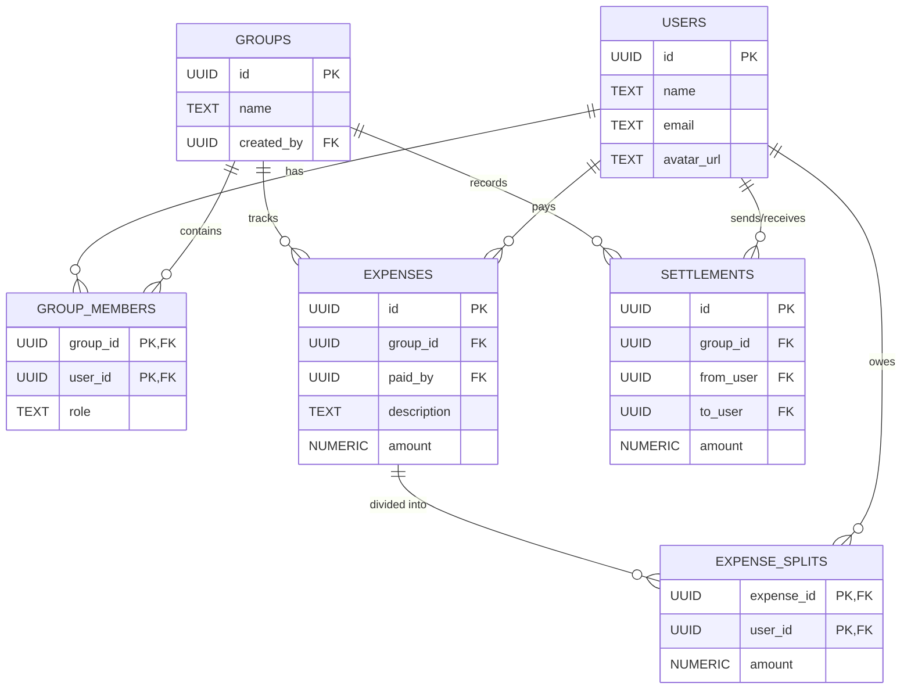

# SplitLedger

A comprehensive group expense and settlement application built with Flutter, PostgreSQL (via Supabase), and native Android components. SplitLedger is designed to manage shared expenses, track group balances, and intelligently simplify debts using an optimized cash-flow algorithm.

## Overview

SplitLedger allows groups of friends, roommates, or travelers to track shared expenses and settle balances efficiently. By utilizing a secure backend and a responsive Flutter frontend, it ensures that all financial data is synchronized in real time while maintaining strict Row Level Security (RLS).

## Architecture & Database Model

The application relies on a strictly typed, relational database schema deployed via Supabase. Below is an illustration of the database entity relationships:



## Key Features

- **Authentication:** Secure sign-up, login, and session persistence utilizing Supabase Auth and database triggers for profile synchronization.
- **Group Management:** Create groups, manage participants, and view all shared financial activities within isolated contexts.
- **Expense Tracking:** Record expenses with varied split methodologies:
  - Equal split (divided evenly among all participants).
  - Unequal split (custom exact amounts per participant).
  - Percentage split (custom percentage allocations per participant).
- **Settlement Engine:** An internal `O(n log n)` min-cash-flow algorithm leveraging priority queues (max-heaps) to simplify group debts into the fewest possible transactions.
- **Security:** End-to-end database security enforced by Row Level Security (RLS) policies. Read and write operations are strictly restricted to authenticated users participating in specific groups, enforced via a non-recursive `SECURITY DEFINER` validation function.

## Prerequisites

- Flutter SDK (v3.11.5 or compatible)
- Dart SDK
- Supabase CLI (for local development and database migrations)
- Android Studio / Android SDK (for building the Android APK)

## Getting Started

### 1. Environment Setup

Clone the repository and prepare your environment variables. In the `mobile/` directory, create a `.env` file referencing your Supabase project credentials.

Example `.env` format:
```env
SUPABASE_URL=your_supabase_project_url
SUPABASE_ANON_KEY=your_supabase_anon_key
```

### 2. Database Migrations

Ensure your local or remote Supabase instance is running, and push the required database migrations to construct the schema, triggers, and security policies.

```bash
cd supabase
supabase status
supabase db push
```

### 3. Running the Application

Navigate to the Flutter project directory, install dependencies, and launch the application on your emulator or connected device.

```bash
cd mobile
flutter pub get
flutter run
```

### 4. Running Tests

SplitLedger includes unit tests covering core business logic, such as the debt simplification priority queue algorithm.

```bash
cd mobile
flutter test test/settlement_engine_test.dart
```

## Building for Release

To generate an APK for Android distribution:

```bash
cd mobile
flutter build apk --release
```

The compiled APK will be located in `build/app/outputs/flutter-apk/app-release.apk`.

## License

This project is licensed under the MIT License. See the LICENSE file for details.