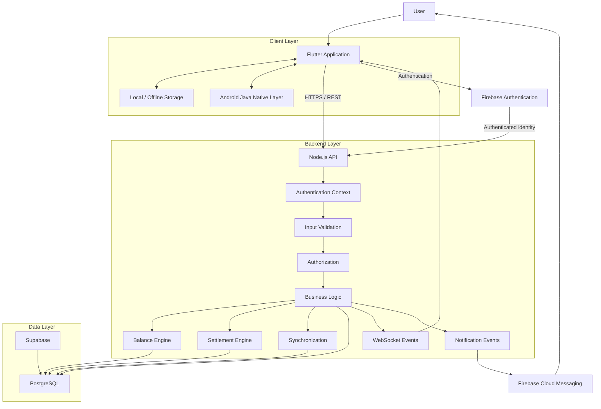
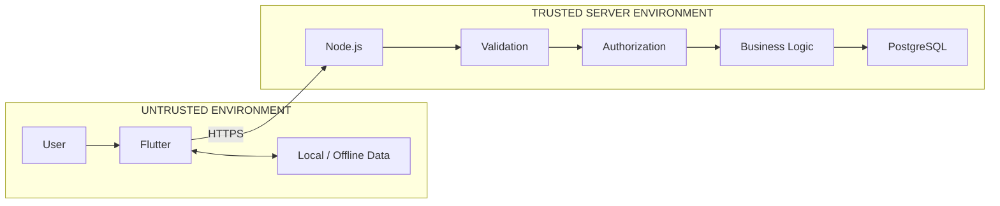
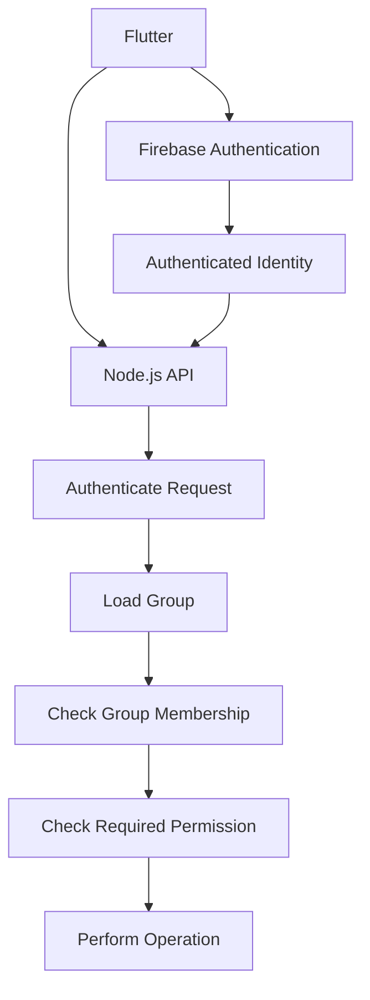
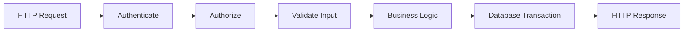
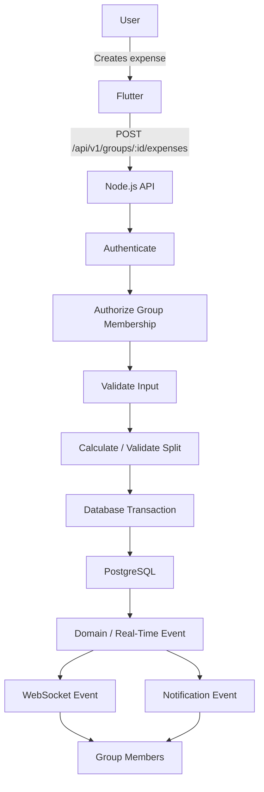
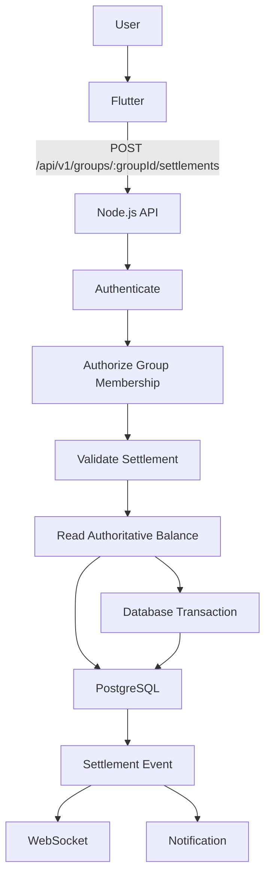
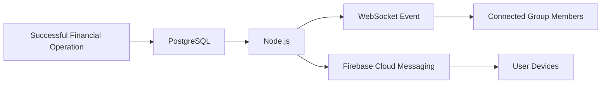
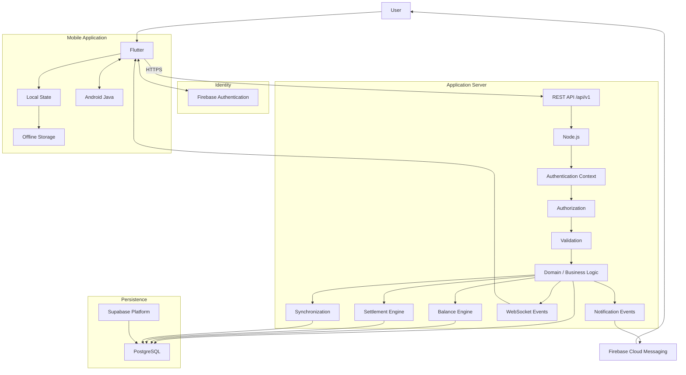

## 1. Overview

SplitLedger is a group expense-sharing application that allows users to create groups, record shared expenses, calculate balances, and settle debts.

The system is designed around a clear separation of responsibilities:

* **Flutter** handles the user interface, local state, offline data, and interaction with the backend.
* **Node.js** provides the API, authorization, business logic, settlement engine, synchronization, and real-time events.
* **PostgreSQL** is the authoritative source of truth for financial and relational data.
* **Firebase Authentication** handles user authentication.
* **Firebase Cloud Messaging (FCM)** handles push notifications.
* **Android Java** is used only where native Android capabilities are required.

The architecture is intentionally designed so that the client is never trusted with security-sensitive or authoritative financial decisions.

---

# 2. Actors

## 2.1 User

A normal SplitLedger user who can:

* Register or sign in
* View their profile
* Sign out
* Create groups
* Join groups
* View groups they belong to
* Add members to groups
* Leave groups
* Add expenses
* View expenses
* View balances
* Settle debts

A user exists globally within the system.

---

## 2.2 Group Member

A **Group Member** is a user who belongs to a particular group.

This distinction is important:

```text
User
  │
  ├── exists globally
  │
  └── may belong to many groups
              │
              ├── Group A membership
              ├── Group B membership
              └── Group C membership
```

Membership is therefore a relationship between a user and a specific group.

Authorization must be evaluated against this relationship.

For example:

> Being an authenticated SplitLedger user does not automatically grant access to every group.

The backend must verify that the authenticated user has the required membership or role within the requested group.

---

# 3. Functional Requirements

## 3.1 Authentication

The system must allow a user to:

* Register
* Sign in
* View their profile
* Sign out

Firebase Authentication is responsible for establishing the user's identity.

Node.js is responsible for validating the authenticated identity before allowing protected operations.

---

## 3.2 Groups

A user can:

* Create a group
* View groups they belong to
* View group details
* Add members
* Leave a group

Group membership is scoped to an individual group.

---

## 3.3 Expenses

A group member can:

* Create an expense
* View expenses
* View expense details
* Edit their own expense
* Delete their own expense

An expense contains:

* Description
* Amount
* Payer
* Participants
* Split method
* Date

The backend remains authoritative for determining whether an expense can be created, modified, or deleted.

---

# 4. Expense Split Methods

Version 1 supports three split methods:

1. Equal
2. Unequal
3. Percentage

---

## 4.1 Equal Split

The expense amount is divided equally among the participants.

Example:

**Total:** ₹1,000

```text
A = ₹500
B = ₹500
```

For `N` participants:

```text
participant_share = total_amount / N
```

The backend must handle monetary precision and rounding deterministically.

---

## 4.2 Percentage Split

Each participant receives a percentage of the total expense.

Example:

**Total:** ₹1,000

```text
A = 60%
B = 40%

A = ₹600
B = ₹400
```

The percentages must satisfy the system's validation rules.

For version 1:

```text
sum(percentages) = 100%
```

The backend must validate this rather than trusting the client.

---

## 4.3 Unequal Split

Each participant receives an explicitly specified share.

Example:

**Total:** ₹1,000

```text
A = ₹700
B = ₹300
```

The backend must verify:

```text
sum(participant_shares) = total_amount
```

An invalid split must be rejected.

---

# 5. Balance Requirements

The system must calculate:

* How much each member owes
* How much each member should receive

Example:

```text
Raj     +₹500
Amit    -₹300
Rahul   -₹200
```

Meaning:

```text
Raj is owed ₹500.
Amit owes ₹300.
Rahul owes ₹200.
```

Balances must be derived from authoritative ledger data.

The client must not be able to submit an arbitrary balance and have the backend accept it as authoritative.

---

# 6. Settlement Requirements

A group member can settle a debt with another member.

Example:

```text
Amit → Raj ₹300
```

Before settlement:

```text
Amit    -₹300
Raj     +₹500
```

After successful settlement:

```text
Amit    ₹0
Raj     +₹200
```

A settlement must be processed as an atomic database operation.

The system must prevent invalid settlements such as:

* Settling with a user outside the group
* Settling more than the outstanding debt
* Settling a negative amount
* Settling against a nonexistent expense or balance
* Creating duplicate settlements

---

# 7. Non-Functional Requirements

## 7.1 Security

The application must:

* Authenticate users
* Authorize group operations
* Never trust client-provided authorization information
* Validate API input
* Protect secrets
* Prevent unauthorized group access
* Enforce database-level access policies where applicable
* Keep financial calculations on trusted backend infrastructure
* Avoid exposing privileged credentials to Flutter

The security model follows:

```text
Authentication
      ↓
Authorization
      ↓
Input Validation
      ↓
Business Logic
      ↓
Database Transaction
```

Authentication answers:

> Who is the user?

Authorization answers:

> Is this user allowed to perform this operation?

These are separate concerns.

---

## 7.2 Reliability

The application should:

* Handle API failures gracefully
* Avoid duplicate expense creation
* Preserve locally created expenses during temporary network loss
* Recover from synchronization failures
* Use transactional writes for financial operations
* Maintain consistency between related ledger records

Offline functionality must never turn the local Flutter database into the authoritative financial ledger.

---

## 7.3 Performance

The initial system does not require premature optimization.

Initial targets:

* Normal API operations should feel responsive.
* UI interactions should not block during network requests.
* Database queries should use appropriate indexes.
* Expensive calculations should not be unnecessarily repeated.
* Real-time updates should be efficient enough for normal group sizes.

Performance should eventually be measured using real metrics rather than assumptions.

---

## 7.4 Maintainability

The system should provide:

* Separation of concerns
* Feature-based Flutter architecture
* Layered Node.js architecture
* Automated tests
* Documentation
* Meaningful Git history
* Clear API boundaries
* Explicit domain rules
* Consistent validation
* Clear error handling

---

# 8. System Boundaries

The system is divided into several major responsibilities.

---

## 8.1 Flutter

Flutter is responsible for:

* UI
* User interaction
* Local state
* Local/offline data
* Calling backend APIs
* Displaying server results
* Handling client-side presentation logic
* Managing temporary synchronization state

Flutter is **not** responsible for:

* Authoritative balance calculations
* Authorization decisions
* Settlement decisions
* Authoritative ledger storage
* Determining whether a user is allowed to access a group

The client can calculate values for presentation, but server results remain authoritative.

---

## 8.2 Node.js

Node.js is responsible for:

* HTTP API
* Authentication context handling
* Authorization
* Input validation
* Business logic
* Expense processing
* Split validation
* Balance calculation
* Settlement engine
* Synchronization
* WebSocket events
* Notification events
* Transaction orchestration

Node.js acts as the trusted application/business-logic boundary between Flutter and PostgreSQL.

---

## 8.3 PostgreSQL

PostgreSQL is responsible for:

* Persistent ledger data
* Users and application identities
* Groups
* Group memberships
* Expenses
* Expense participants
* Settlements
* Relationships
* Constraints
* Referential integrity
* Transactional integrity
* Authoritative financial state

PostgreSQL is the **source of truth for financial data**.

---

## 8.4 Supabase

Supabase may provide the managed PostgreSQL infrastructure and related database capabilities.

Conceptually:

```text
Supabase
   │
   └── PostgreSQL
          │
          ├── Tables
          ├── Constraints
          ├── Transactions
          └── Row-Level Security
```

Supabase is infrastructure/platform support.

It does not replace Node.js as the application's authoritative business-logic boundary.

---

## 8.5 Firebase Authentication

Firebase Authentication is responsible for:

* User registration
* Sign-in
* Identity management
* Authentication sessions/tokens

The backend must validate the authenticated identity before processing protected operations.

Firebase Authentication does not determine whether a user can modify a particular group.

That decision belongs to application authorization rules.

---

## 8.6 Firebase Cloud Messaging

Firebase Cloud Messaging (FCM) is responsible for push notification delivery.

Examples:

```text
New expense added
       ↓
Node.js event
       ↓
Notification service
       ↓
FCM
       ↓
User device
```

Notifications are not the authoritative ledger.

---

## 8.7 Android Java

Android Java is reserved for native Android capabilities that cannot or should not be implemented entirely through Flutter.

Examples may include:

* Native platform integrations
* Android-specific services
* Platform channels
* OS-level functionality

Android Java does not own application financial state.

---

# 9. High-Level System Architecture



---

# 10. Trust Boundary

The most important security principle is:

> **The client is never trusted.**

The trust boundary can be represented as:



Everything crossing from Flutter into Node.js must be treated as untrusted input.

For example, Flutter may send:

```json
{
  "amount": 500,
  "groupId": "123"
}
```

The backend must not assume the user has access to group `123`.

Instead:

```text
Authenticated?
      ↓
Does group exist?
      ↓
Is user a member?
      ↓
Does user have required permission?
      ↓
Is request valid?
      ↓
Is expense valid?
      ↓
Perform transaction
```

---

# 11. Authentication and Authorization Model

Authentication and authorization are separate.



A valid Firebase identity does not automatically grant access to every SplitLedger resource.

For group-specific operations, Node.js must check the user's membership in the requested group.

---

# 12. Data Ownership Model

The system follows this ownership model:

| Concern                     | Owner                   |
| --------------------------- | ----------------------- |
| UI                          | Flutter                 |
| Client state                | Flutter                 |
| Offline cache               | Flutter                 |
| Authentication              | Firebase Authentication |
| API                         | Node.js                 |
| Authorization               | Node.js                 |
| Business logic              | Node.js                 |
| Balance engine              | Node.js                 |
| Settlement engine           | Node.js                 |
| Persistent financial data   | PostgreSQL              |
| Database constraints        | PostgreSQL              |
| Transactions                | PostgreSQL              |
| Push notification delivery  | FCM                     |
| Native Android capabilities | Android Java            |

---

# 13. Source of Truth

## 13.1 Financial Source of Truth

> **PostgreSQL is the authoritative source of truth for financial data.**

This means:

```text
Flutter cache
     ≠
Authoritative ledger
```

and:

```text
Firebase
     ≠
Financial ledger
```

and:

```text
Node.js memory
     ≠
Permanent financial storage
```

Instead:

```text
                    ┌─────────────────┐
                    │    Flutter      │
                    │ Cache / Offline │
                    └────────┬────────┘
                             │
                             │ synchronization
                             ▼
                    ┌─────────────────┐
                    │    Node.js      │
                    │ Business Logic  │
                    └────────┬────────┘
                             │
                             ▼
                    ┌─────────────────┐
                    │   PostgreSQL    │
                    │ SOURCE OF TRUTH │
                    └─────────────────┘
```

This decision is fundamental to the offline synchronization design.

---

# 14. Offline Data Principle

Flutter may create and retain local records when the device temporarily has no network connection.

However:

> Local records are pending state until accepted by the server.

Conceptually:

```text
LOCAL
  │
  │ pending
  ▼
SYNC QUEUE
  │
  │ network available
  ▼
NODE.JS
  │
  │ validate + authorize
  ▼
POSTGRESQL
  │
  │ accepted
  ▼
AUTHORITATIVE STATE
```

The synchronization system must eventually handle:

* Network failures
* Retry
* Duplicate requests
* Conflicting updates
* Failed validation
* Server rejection
* Recovery after application restart

Detailed synchronization architecture will be designed in a later milestone.

---

# 15. API Design

The initial API uses explicit versioning:

```text
/api/v1
```

This establishes a stable public API boundary and allows future versions to coexist if breaking changes become necessary.

---

## 15.1 Authentication

```http
GET /api/v1/me
```

Returns information about the currently authenticated application user.

---

## 15.2 Groups

```http
POST   /api/v1/groups
GET    /api/v1/groups
GET    /api/v1/groups/:groupId
POST   /api/v1/groups/:groupId/members
```

---

## 15.3 Expenses

```http
POST   /api/v1/groups/:groupId/expenses
GET    /api/v1/groups/:groupId/expenses
GET    /api/v1/expenses/:expenseId
PATCH  /api/v1/expenses/:expenseId
DELETE /api/v1/expenses/:expenseId
```

---

## 15.4 Balances

```http
GET /api/v1/groups/:groupId/balances
```

---

## 15.5 Settlements

```http
GET  /api/v1/groups/:groupId/settlements
POST /api/v1/groups/:groupId/settlements
```

---

# 16. API Request Processing Pipeline

Every protected request should conceptually pass through:



The order is intentional.

The system must not perform business operations before authorization and validation.

---

# 17. Expense Creation Flow

The first important end-to-end system flow is expense creation.



The server is responsible for validating the expense and its split before committing the transaction.

---

# 18. Expense Processing Rules

When an expense is created:

```text
1. Authenticate the user
2. Verify the group exists
3. Verify the user belongs to the group
4. Validate the request payload
5. Validate amount
6. Validate payer
7. Validate participants
8. Validate split method
9. Validate split amounts/percentages
10. Calculate authoritative shares
11. Begin database transaction
12. Persist expense
13. Persist participant shares
14. Commit transaction
15. Emit appropriate events
```

If any critical database operation fails:

```text
Transaction
    ↓
ROLLBACK
```

No partially-created financial record should remain.

---

# 19. Settlement Flow

Settlements are financial operations and must be treated transactionally.



The settlement request must be validated against authoritative server state.

---

# 20. Balance Model

Balances are derived from financial activity.

Conceptually:

```text
Expense
   │
   ├── Payer
   │
   └── Participant Shares
            │
            ▼
       Ledger Effect
            │
            ▼
         Balance
```

Example:

```text
Expense: ₹1,000

Raj paid ₹1,000

Raj's share     ₹500
Amit's share    ₹300
Rahul's share   ₹200
```

Result:

```text
Raj     +₹500
Amit    -₹300
Rahul   -₹200
```

The authoritative balance is calculated from the database state rather than accepted from Flutter.

---

# 21. Real-Time Event Flow

After successful database operations, the backend may notify connected clients.



Real-time events improve responsiveness, but they are not the source of truth.

If a WebSocket event is lost:

```text
Client
  ↓
API
  ↓
PostgreSQL
```

can still recover the authoritative state.

---

# 22. Failure and Reliability Model

The architecture assumes that networks and external services can fail.

Examples:

```text
Flutter
   │
   X
Network failure
```

or:

```text
Node.js
   │
   X
Database temporarily unavailable
```

or:

```text
Node.js
   │
   X
Notification delivery failure
```

The system must distinguish between:

### Financial operation failure

The expense or settlement was not committed.

### Notification failure

The financial operation succeeded, but a notification could not be delivered.

These must not be treated as the same failure.

For example:

```text
Expense transaction
       │
       ▼
PostgreSQL COMMIT
       │
       ├──────────────► Financial operation succeeded
       │
       ▼
Notification
       │
       X
       │
       ▼
Notification failed
```

The notification failure must not roll back an already committed financial transaction unless the architecture explicitly requires transactional notification semantics.

---

# 23. Duplicate Expense Protection

Reliability requires protection against duplicate requests.

A common failure scenario:

```text
Flutter
  │
  │ POST expense
  ▼
Node.js
  │
  ▼
PostgreSQL
  │
  │ COMMIT
  ▼
Network failure
  │
  ▼
Flutter thinks request failed
  │
  │ retry
  ▼
Node.js
```

Without protection, the same expense could be created twice.

Therefore, the future synchronization/API design must support an idempotency strategy.

Conceptually:

```text
Client Operation ID
        │
        ▼
Node.js
        │
        ▼
PostgreSQL uniqueness constraint
        │
        ├── first request → create
        │
        └── retry         → return existing result
```

The exact implementation will be defined during the synchronization and database design milestones.

---

# 24. Database Integrity Principles

PostgreSQL must protect important invariants wherever practical.

Examples include:

```text
Expense belongs to an existing group
Membership references an existing user
Membership references an existing group
Expense participant belongs to the relevant group
Settlement belongs to the relevant group
Amounts cannot violate monetary constraints
Required relationships cannot be NULL
Duplicate memberships should be prevented
```

Application-level validation is necessary, but database constraints provide an additional safety boundary.

---

# 25. Authorization Model

Authorization must be based on the resource being accessed.

For a group operation:

```text
Authenticated User
        │
        ▼
Requested Group
        │
        ▼
Membership Exists?
        │
     ┌──┴──┐
     │     │
    YES    NO
     │     │
     ▼     ▼
Allowed  Denied
```

For operations requiring ownership or additional permissions:

```text
Authenticated User
        │
        ▼
Group Membership
        │
        ▼
Required Role / Ownership
        │
        ▼
Permission Check
        │
        ▼
Operation
```

The client must never be allowed to decide its own authorization level.

---

# 26. Architectural Principles

SplitLedger follows these principles:

## 26.1 Client is not trusted

Flutter input must be validated by the backend.

---

## 26.2 Authentication is not authorization

A valid user identity does not imply access to every group.

---

## 26.3 PostgreSQL is authoritative

Financial state is ultimately determined by PostgreSQL.

---

## 26.4 Business rules belong on the server

Balance calculations, settlement rules, and permission checks must not depend on Flutter behaving correctly.

---

## 26.5 Database transactions protect financial operations

Operations that modify related financial records should be atomic.

---

## 26.6 Offline data is temporary until synchronized

Local data improves reliability and user experience but does not override authoritative server state.

---

## 26.7 Events are derived from successful state changes

WebSocket and notification events should represent changes to authoritative state rather than becoming the state themselves.

---

## 26.8 API versioning starts from version one

All API endpoints are placed under:

```text
/api/v1
```

---

# 27. Initial Architecture Diagram

The following diagram represents the current architecture at the end of Milestone 2.



---

# 28. System Flow Summary

The complete conceptual flow is:

```text
                         ┌─────────────┐
                         │    User     │
                         └──────┬──────┘
                                │
                                ▼
                         ┌─────────────┐
                         │   Flutter   │
                         └──────┬──────┘
                                │
                          HTTPS / REST
                                │
                                ▼
                         ┌─────────────┐
                         │   Node.js   │
                         └──────┬──────┘
                                │
                 ┌──────────────┼──────────────┐
                 │              │              │
                 ▼              ▼              ▼
            Validation     Authorization   Business Logic
                 │              │              │
                 └──────────────┼──────────────┘
                                │
                                ▼
                       ┌─────────────────┐
                       │   PostgreSQL    │
                       │ SOURCE OF TRUTH │
                       └────────┬────────┘
                                │
                     ┌──────────┴──────────┐
                     │                     │
                     ▼                     ▼
               WebSocket                FCM
                     │                     │
                     ▼                     ▼
                 Flutter                Devices
```

---

# 29. Initial API Boundary Summary

| Domain         | Method | Endpoint                              | Purpose            |
| -------------- | ------ | ------------------------------------- | ------------------ |
| Authentication | GET    | `/api/v1/me`                          | Get current user   |
| Groups         | POST   | `/api/v1/groups`                      | Create group       |
| Groups         | GET    | `/api/v1/groups`                      | List user's groups |
| Groups         | GET    | `/api/v1/groups/:groupId`             | Get group details  |
| Groups         | POST   | `/api/v1/groups/:groupId/members`     | Add member         |
| Expenses       | POST   | `/api/v1/groups/:groupId/expenses`    | Create expense     |
| Expenses       | GET    | `/api/v1/groups/:groupId/expenses`    | List expenses      |
| Expenses       | GET    | `/api/v1/expenses/:expenseId`         | Get expense        |
| Expenses       | PATCH  | `/api/v1/expenses/:expenseId`         | Update expense     |
| Expenses       | DELETE | `/api/v1/expenses/:expenseId`         | Delete expense     |
| Balances       | GET    | `/api/v1/groups/:groupId/balances`    | Get balances       |
| Settlements    | GET    | `/api/v1/groups/:groupId/settlements` | List settlements   |
| Settlements    | POST   | `/api/v1/groups/:groupId/settlements` | Create settlement  |

---

