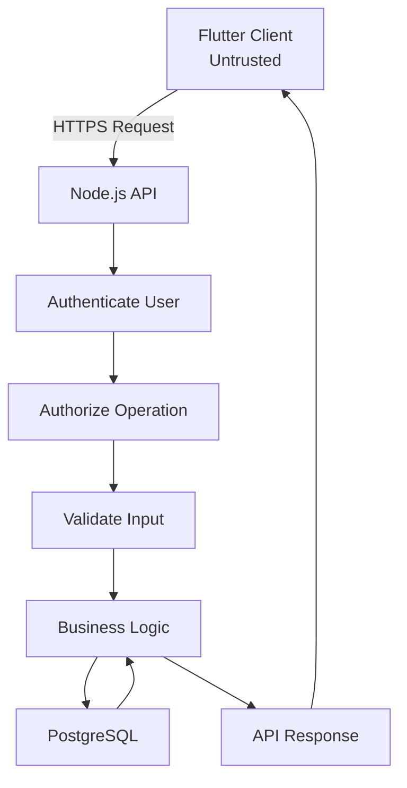
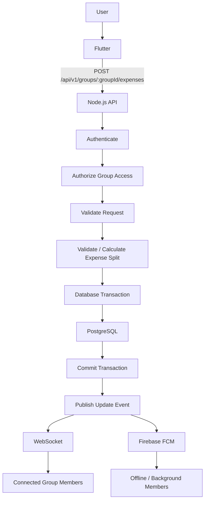
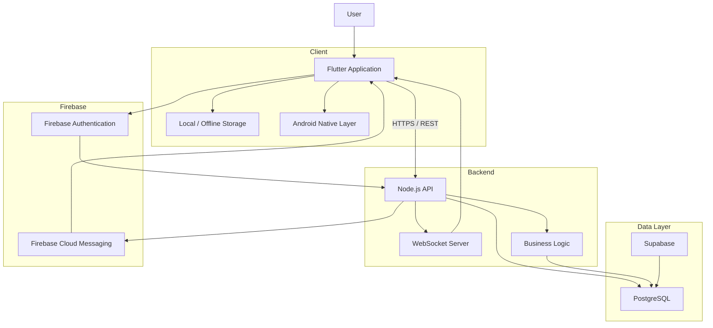

# Step 2.3 — Non-Functional Requirements

## Security

The application must:

* Authenticate users before allowing access to protected resources.
* Authorize users before allowing group operations.
* Never rely on authorization information sent by the client.
* Keep API keys, credentials, and other secrets out of the client application.
* Validate all API input on the server.
* Enforce appropriate database-level access policies.
* Prevent users from accessing or modifying data belonging to groups they are not members of.

---

## Reliability

The application should:

* Handle API failures gracefully.
* Prevent duplicate expense creation when the same request is retried.
* Preserve locally created expenses when the device temporarily loses network connectivity.
* Retry failed synchronization operations where appropriate.
* Recover from synchronization failures without losing locally created data.
* Keep the financial ledger consistent even when multiple operations occur at the same time.

---

## Performance

The initial version does not require aggressive optimization.

The following are the initial performance expectations:

* Normal API operations should be responsive.
* Network operations should not block the UI.
* Database queries should use appropriate indexes.
* Large lists should be loaded using pagination where necessary.
* Expensive calculations should not unnecessarily run on the client.

Performance will be measured and optimized based on actual usage and profiling rather than assumptions.

---

## Maintainability

The system should follow:

* Separation of concerns
* Feature-based Flutter architecture
* Layered backend architecture
* Clear API boundaries
* Automated tests
* Documentation
* Consistent coding conventions
* Meaningful Git history

Business logic should not be duplicated between the Flutter application and the backend.

---

# Step 2.4 — System Boundaries

The system is divided into several major components. Each component has a clearly defined responsibility.

## Flutter

Flutter is responsible for:

* UI rendering
* User interaction
* Local application state
* Local and offline data
* Calling backend APIs
* Displaying server results
* Handling client-side validation for user experience

Flutter is **not** responsible for:

* Authoritative balance calculations
* Authorization decisions
* Settlement decisions
* Maintaining the authoritative financial ledger

The client may calculate or display temporary values for a better user experience, but the server remains authoritative.

---

## Node.js

Node.js is responsible for:

* REST API
* Authentication verification
* Authorization
* Request validation
* Business logic
* Expense processing
* Balance calculations
* Settlement processing
* Synchronization
* WebSocket events

The backend is the main enforcement point for application rules.

---

## PostgreSQL / Supabase

PostgreSQL is responsible for:

* Persistent ledger data
* Users and group relationships
* Expenses
* Expense splits
* Balances and settlement records
* Database relationships
* Constraints
* Transactions
* Data consistency

Supabase provides the managed PostgreSQL infrastructure and related database services.

PostgreSQL is the authoritative source of truth for financial data.

---

## Firebase

Firebase is responsible for services that are better handled outside the core ledger:

* Authentication
* Push notifications through Firebase Cloud Messaging (FCM)

Firebase is **not** the source of truth for expenses, balances, or settlements.

---

## Android Java

Android-specific Java/Kotlin code may be used where native Android integration is required.

Examples include:

* Platform-specific functionality
* Native Android integrations
* Background services where required
* Firebase or notification integration that requires Android-specific handling

The majority of the application logic remains in Flutter.

---

# Step 2.5 — Trust Boundary

The client is considered **untrusted**.

A request coming from Flutter must not be treated as proof that the user has permission to perform an operation.



For example, Flutter may send:

```json
{
  "amount": 500,
  "groupId": "123"
}
```

The backend must not assume that the current user is allowed to modify group `123`.

Node.js should verify the request in this order:

```text
Is the user authenticated?
        ↓
Does the group exist?
        ↓
Is the user a member of the group?
        ↓
Is the requested operation allowed?
        ↓
Is the input valid?
        ↓
Execute the business operation
        ↓
Commit the database transaction
```

The important rule is:

> **The client is never trusted for authorization.**

---

# Step 2.6 — Initial API Boundary

The initial API will use versioning through the `/api/v1` prefix.

This allows future API versions to be introduced without immediately breaking existing clients.

## Authentication

```http
GET /api/v1/me
```

Returns information about the currently authenticated user.

---

## Groups

```http
POST   /api/v1/groups
GET    /api/v1/groups
GET    /api/v1/groups/:groupId
POST   /api/v1/groups/:groupId/members
```

---

## Expenses

```http
POST   /api/v1/groups/:groupId/expenses
GET    /api/v1/groups/:groupId/expenses
GET    /api/v1/expenses/:expenseId
PATCH  /api/v1/expenses/:expenseId
DELETE /api/v1/expenses/:expenseId
```

---

## Balances

```http
GET /api/v1/groups/:groupId/balances
```

---

## Settlements

```http
GET  /api/v1/groups/:groupId/settlements
POST /api/v1/groups/:groupId/settlements
```

These endpoints represent the initial API boundary. Request and response schemas will be defined separately during API design.

---

# Step 2.7 — Initial Expense Flow

When a user creates an expense, the request follows this general flow:



The database transaction is the important part of the flow.

An expense should not be considered successfully created until the required database changes have been committed successfully.

---

# Step 2.8 — Source of Truth

PostgreSQL is the authoritative source of truth for all financial data.

This includes:

* Expenses
* Expense splits
* Group membership
* Balances
* Settlements
* Other ledger-related records

Flutter may maintain cached or offline data, but that data is not authoritative.

```text
Flutter local data
        ≠
Authoritative ledger
```

Similarly:

```text
Firebase
        ≠
Financial ledger
```

and:

```text
Node.js
        ≠
Permanent storage
```

The authoritative financial state is stored in PostgreSQL.

This distinction is important for the offline synchronization design.

---

# Step 2.9 — System Architecture Diagram

The initial architecture is:



## Component Responsibilities

| Component               | Responsibility                                          |
| ----------------------- | ------------------------------------------------------- |
| Flutter                 | UI, user interaction, local state, API communication    |
| Local Storage           | Offline data and pending synchronization operations     |
| Android Native Layer    | Android-specific functionality                          |
| Node.js                 | API, authorization, validation, business logic          |
| WebSocket               | Real-time updates                                       |
| Supabase                | Managed PostgreSQL infrastructure and database services |
| PostgreSQL              | Authoritative application and financial data            |
| Firebase Authentication | User authentication                                     |
| Firebase FCM            | Push notifications                                      |

The architecture keeps the financial ledger behind the backend and database boundary. The Flutter application can cache and synchronize data, but it cannot make authoritative decisions about balances, permissions, or settlements.
# Step 2.3 — Non-Functional Requirements

## Security

The application must:

* Authenticate users before allowing access to protected resources.
* Authorize users before allowing group operations.
* Never rely on authorization information sent by the client.
* Keep API keys, credentials, and other secrets out of the client application.
* Validate all API input on the server.
* Enforce appropriate database-level access policies.
* Prevent users from accessing or modifying data belonging to groups they are not members of.

---

## Reliability

The application should:

* Handle API failures gracefully.
* Prevent duplicate expense creation when the same request is retried.
* Preserve locally created expenses when the device temporarily loses network connectivity.
* Retry failed synchronization operations where appropriate.
* Recover from synchronization failures without losing locally created data.
* Keep the financial ledger consistent even when multiple operations occur at the same time.

---

## Performance

The initial version does not require aggressive optimization.

The following are the initial performance expectations:

* Normal API operations should be responsive.
* Network operations should not block the UI.
* Database queries should use appropriate indexes.
* Large lists should be loaded using pagination where necessary.
* Expensive calculations should not unnecessarily run on the client.

Performance will be measured and optimized based on actual usage and profiling rather than assumptions.

---

## Maintainability

The system should follow:

* Separation of concerns
* Feature-based Flutter architecture
* Layered backend architecture
* Clear API boundaries
* Automated tests
* Documentation
* Consistent coding conventions
* Meaningful Git history

Business logic should not be duplicated between the Flutter application and the backend.

---

# Step 2.4 — System Boundaries

The system is divided into several major components. Each component has a clearly defined responsibility.

## Flutter

Flutter is responsible for:

* UI rendering
* User interaction
* Local application state
* Local and offline data
* Calling backend APIs
* Displaying server results
* Handling client-side validation for user experience

Flutter is **not** responsible for:

* Authoritative balance calculations
* Authorization decisions
* Settlement decisions
* Maintaining the authoritative financial ledger

The client may calculate or display temporary values for a better user experience, but the server remains authoritative.

---

## Node.js

Node.js is responsible for:

* REST API
* Authentication verification
* Authorization
* Request validation
* Business logic
* Expense processing
* Balance calculations
* Settlement processing
* Synchronization
* WebSocket events

The backend is the main enforcement point for application rules.

---

## PostgreSQL / Supabase

PostgreSQL is responsible for:

* Persistent ledger data
* Users and group relationships
* Expenses
* Expense splits
* Balances and settlement records
* Database relationships
* Constraints
* Transactions
* Data consistency

Supabase provides the managed PostgreSQL infrastructure and related database services.

PostgreSQL is the authoritative source of truth for financial data.

---

## Firebase

Firebase is responsible for services that are better handled outside the core ledger:

* Authentication
* Push notifications through Firebase Cloud Messaging (FCM)

Firebase is **not** the source of truth for expenses, balances, or settlements.

---

## Android Java

Android-specific Java/Kotlin code may be used where native Android integration is required.

Examples include:

* Platform-specific functionality
* Native Android integrations
* Background services where required
* Firebase or notification integration that requires Android-specific handling

The majority of the application logic remains in Flutter.

---

# Step 2.5 — Trust Boundary

The client is considered **untrusted**.

A request coming from Flutter must not be treated as proof that the user has permission to perform an operation.


For example, Flutter may send:

```json
{
  "amount": 500,
  "groupId": "123"
}
```

The backend must not assume that the current user is allowed to modify group `123`.

Node.js should verify the request in this order:

```text
Is the user authenticated?
        ↓
Does the group exist?
        ↓
Is the user a member of the group?
        ↓
Is the requested operation allowed?
        ↓
Is the input valid?
        ↓
Execute the business operation
        ↓
Commit the database transaction
```

The important rule is:

> **The client is never trusted for authorization.**

---

# Step 2.6 — Initial API Boundary

The initial API will use versioning through the `/api/v1` prefix.

This allows future API versions to be introduced without immediately breaking existing clients.

## Authentication

```http
GET /api/v1/me
```

Returns information about the currently authenticated user.

---

## Groups

```http
POST   /api/v1/groups
GET    /api/v1/groups
GET    /api/v1/groups/:groupId
POST   /api/v1/groups/:groupId/members
```

---

## Expenses

```http
POST   /api/v1/groups/:groupId/expenses
GET    /api/v1/groups/:groupId/expenses
GET    /api/v1/expenses/:expenseId
PATCH  /api/v1/expenses/:expenseId
DELETE /api/v1/expenses/:expenseId
```

---

## Balances

```http
GET /api/v1/groups/:groupId/balances
```

---

## Settlements

```http
GET  /api/v1/groups/:groupId/settlements
POST /api/v1/groups/:groupId/settlements
```

These endpoints represent the initial API boundary. Request and response schemas will be defined separately during API design.

---

# Step 2.7 — Initial Expense Flow

When a user creates an expense, the request follows this general flow:


The database transaction is the important part of the flow.

An expense should not be considered successfully created until the required database changes have been committed successfully.

---

# Step 2.8 — Source of Truth

PostgreSQL is the authoritative source of truth for all financial data.

This includes:

* Expenses
* Expense splits
* Group membership
* Balances
* Settlements
* Other ledger-related records

Flutter may maintain cached or offline data, but that data is not authoritative.

```text
Flutter local data
        ≠
Authoritative ledger
```

Similarly:

```text
Firebase
        ≠
Financial ledger
```

and:

```text
Node.js
        ≠
Permanent storage
```

The authoritative financial state is stored in PostgreSQL.

This distinction is important for the offline synchronization design.

---

# Step 2.9 — System Architecture Diagram

The initial architecture is:


## Component Responsibilities

| Component               | Responsibility                                          |
| ----------------------- | ------------------------------------------------------- |
| Flutter                 | UI, user interaction, local state, API communication    |
| Local Storage           | Offline data and pending synchronization operations     |
| Android Native Layer    | Android-specific functionality                          |
| Node.js                 | API, authorization, validation, business logic          |
| WebSocket               | Real-time updates                                       |
| Supabase                | Managed PostgreSQL infrastructure and database services |
| PostgreSQL              | Authoritative application and financial data            |
| Firebase Authentication | User authentication                                     |
| Firebase FCM            | Push notifications                                      |

The architecture keeps the financial ledger behind the backend and database boundary. The Flutter application can cache and synchronize data, but it cannot make authoritative decisions about balances, permissions, or settlements.
