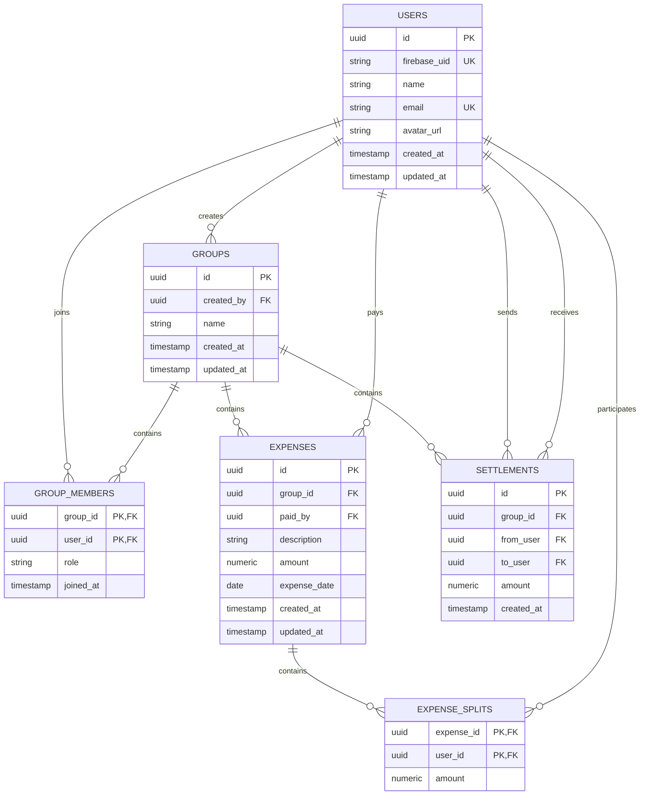

# Milestone 3 — Database Design

## Overview

The purpose of this milestone is to design SplitLedger's financial data model before creating the actual Supabase database.

The initial relational model will represent:

```text
User
 ↓
Group
 ↓
Group Members
 ↓
Expenses
 ↓
Expense Splits
 ↓
Settlements
```

PostgreSQL will be the authoritative source of truth for SplitLedger's financial and relational data.

The database will be designed first and implemented later through version-controlled migrations.

---

# Step 3.1 — Database Fundamentals

SplitLedger uses PostgreSQL as its relational database.

The following database concepts are important for the design:

* Tables
* Rows
* Columns
* Primary keys
* Foreign keys
* Unique constraints
* `NOT NULL`
* `CHECK` constraints
* Default values
* Indexes
* One-to-one relationships
* One-to-many relationships
* Many-to-many relationships
* Normalization
* Transactions
* `ON DELETE` behavior
* Timestamps

A foreign key such as:

```sql
FOREIGN KEY (group_id) REFERENCES groups(id)
```

means that every `group_id` stored in the referencing table must correspond to an existing `id` in the `groups` table.

This allows the database to enforce relationships and prevent invalid references.

---

# Step 3.2 — Database Design Principles

The database design follows these principles:

1. PostgreSQL is the authoritative source of truth for financial data.
2. Relationships should be enforced using foreign keys.
3. Important business invariants should be protected at the database level where practical.
4. Financial amounts must use exact numeric representation.
5. Financial records should not be casually deleted.
6. Multi-step financial operations should use database transactions.
7. Indexes should support actual query patterns rather than being added indiscriminately.
8. The schema should remain normalized and avoid unnecessary duplication.

---

# Step 3.3 — Users

## Conceptual Model

```text
users
-----
id
firebase_uid
name
email
avatar_url
created_at
updated_at
```

### Authentication Ownership

Firebase Authentication owns the authentication identity.

The PostgreSQL `users` table represents the application's user profile and domain identity.

The relationship is:

```text
Firebase Authentication
        │
        │ Firebase UID
        ▼
PostgreSQL users
```

The `firebase_uid` column associates the application user with their Firebase Authentication identity.

### Design Decision

The application database does not store a password.

Authentication credentials are managed by Firebase Authentication.

The application database stores the Firebase identity required to associate authenticated users with application-level data.

The Firebase UID should be unique because one Firebase identity must map to only one application user.

---

# Step 3.4 — Groups

## Conceptual Model

```text
groups
------
id
name
created_by
created_at
updated_at
```

A user can create multiple groups.

Therefore:

```text
User 1 ───────── * Groups
```

The foreign key belongs on the `groups` table:

```text
groups.created_by → users.id
```

This represents the user who originally created the group.

The group creator is also expected to be a member of the group through the `group_members` relationship.

---

# Step 3.5 — Group Members

Users and groups have a many-to-many relationship.

A user can belong to multiple groups, and a group can contain multiple users.

```text
User * ───────── * Group
```

A relational database represents this relationship using a junction table:

```text
group_members
-------------
group_id
user_id
role
joined_at
```

Relationships:

```text
users
  │
  │
  ▼
group_members
  ▲
  │
  │
groups
```

### Membership Uniqueness

A user must not be added to the same group more than once.

The database should therefore enforce uniqueness across:

```text
group_id + user_id
```

Conceptually:

```text
UNIQUE(group_id, user_id)
```

This prevents invalid data such as:

```text
group_id | user_id
---------+--------
GOA      | RAJ
GOA      | RAJ
```

The database should enforce this rule rather than relying only on Flutter or Node.js.

### Membership Role

The `role` field allows the system to distinguish different types of group members.

The initial roles may include:

```text
owner
member
```

The exact authorization rules for each role will be defined separately.

---

# Step 3.6 — Expenses

## Conceptual Model

```text
expenses
--------
id
group_id
paid_by
description
amount
expense_date
created_at
updated_at
```

An expense belongs to exactly one group.

Therefore:

```text
Group 1 ───────── * Expenses
```

The expense also records the user who originally paid the expense:

```text
User 1 ───────── * Expenses
                    ↑
                  paid_by
```

For example:

```text
Raj paid ₹1,200 for dinner.
```

The expense records:

```text
group_id = Goa Trip
paid_by  = Raj
amount   = ₹1,200
```

The expense itself does not contain enough information to determine how the cost should be distributed.

That information belongs in `expense_splits`.

---

# Step 3.7 — Expense Splits

An expense can be split between multiple users.

The conceptual structure is:

```text
expense_splits
--------------
expense_id
user_id
amount
```

For example:

```text
Expense #101
Total: ₹1,200
```

Splits:

```text
Raj       ₹400
Amit      ₹400
Rahul     ₹400
```

Database representation:

```text
expense_id | user_id | amount
-----------+---------+-------
101        | Raj     | 400
101        | Amit    | 400
101        | Rahul   | 400
```

### Split Relationships

```text
Expense 1 ───────── * Expense Splits
                          │
                          └──────── User
```

An individual user should appear at most once in the splits for a particular expense.

The database should therefore enforce:

```text
UNIQUE(expense_id, user_id)
```

This prevents:

```text
expense_id | user_id | amount
-----------+---------+-------
101        | Raj     | 400
101        | Raj     | 200
```

---

# Step 3.8 — Money Representation

Financial values must not use floating-point types such as:

```text
FLOAT
DOUBLE
```

Floating-point representation can introduce precision errors.

PostgreSQL's exact numeric type is more appropriate for financial amounts.

SplitLedger will use:

```text
NUMERIC(12,2)
```

for monetary amounts.

This allows values such as:

```text
₹10.50
₹500.00
₹1,250.75
```

to be represented exactly to two decimal places.

### Design Decision

All monetary amounts stored in the database will use an exact numeric representation.

The database should also ensure that monetary values are not negative where the domain does not allow negative values.

For example:

```text
amount > 0
```

can be enforced using a `CHECK` constraint.

---

# Step 3.9 — Expense Validation

Consider the following expense:

```text
Total expense = ₹1,000

Splits:
Raj     ₹400
Amit    ₹300
Rahul   ₹100

Total splits = ₹800
```

This expense is invalid because:

```text
₹400 + ₹300 + ₹100 ≠ ₹1,000
```

The backend must validate this business rule before accepting the expense.

## Database vs Business Logic

The database is responsible for enforcing structural invariants such as:

* Expense amount must be greater than zero.
* Split amount must be greater than zero.
* A split cannot reference a nonexistent expense.
* A split cannot reference a nonexistent user.
* A user cannot appear twice in the same expense's splits.

The backend is responsible for validating rules that require aggregating multiple rows, such as:

```text
SUM(expense_splits.amount) = expenses.amount
```

This validation belongs in the expense creation/update transaction.

The database transaction should ensure that the expense and its splits are committed together.

---

# Step 3.10 — Settlements

A settlement represents a completed debt payment between two members.

## Conceptual Model

```text
settlements
-----------
id
group_id
from_user
to_user
amount
created_at
```

For example:

```text
Amit → Raj ₹500
```

is represented as:

```text
from_user = Amit
to_user   = Raj
amount    = ₹500
```

The relationships are:

```text
Group 1 ───────── * Settlements

User 1 ───────── * Settlements
                    ↑
                from_user

User 1 ───────── * Settlements
                    ↑
                 to_user
```

---

# Step 3.11 — Settlement Validation

A user cannot settle a debt with themselves.

Therefore:

```text
from_user ≠ to_user
```

should be enforced as a database constraint.

Conceptually:

```sql
CHECK (from_user <> to_user)
```

The settlement amount must also be positive:

```sql
CHECK (amount > 0)
```

The backend should additionally verify that the settlement is valid for the user's current outstanding balance.

---

# Step 3.12 — Settlement Status

The first version does not require a settlement status such as:

```text
pending
completed
cancelled
```

A settlement in SplitLedger represents a user-confirmed settlement.

The workflow is:

```text
User confirms settlement
        ↓
Server validates request
        ↓
Database transaction
        ↓
Settlement recorded
        ↓
Debt is considered settled
```

There is no external payment processor involved in the initial version.

Therefore, adding a payment state machine would introduce unnecessary complexity.

If a future version integrates an external payment provider, settlement status can be introduced at that point.

---

# Step 3.13 — Deletion Behavior

Financial records should not casually disappear.

Deleting a group that already contains expenses would also risk deleting important financial history.

For the initial version:

* Groups should not be hard-deleted once they contain financial records.
* Expenses should not be physically deleted after they become part of the financial history.
* Settlement records should remain part of the ledger.
* Group membership history should not be destroyed simply because a member leaves.

Where deletion is required for the application, a soft-delete or archival approach can be considered.

The exact soft-delete fields will be introduced only where the application actually requires them.

### Database Cascades

Cascading deletes should therefore be used carefully.

For relationships such as:

```text
Expense
  ↓
Expense Splits
```

deleting an expense may technically require its splits to be removed.

However, because expenses represent financial records, the application should generally avoid deleting them casually.

---

# Step 3.14 — Transactions

Financial operations that modify multiple related records must use database transactions.

A transaction follows the pattern:

```text
BEGIN
   ↓
Operation 1
   ↓
Operation 2
   ↓
Operation 3
   ↓
COMMIT
```

If an operation fails:

```text
BEGIN
   ↓
Operation 1
   ↓
Operation 2 fails
   ↓
ROLLBACK
```

For example, creating an expense may involve:

```text
Create expense
      +
Create expense splits
```

We must avoid a partially completed operation such as:

```text
Expense created       ✅
Split 1 created       ✅
Split 2 created       ✅
Split 3 failed        ❌
```

Instead, the entire operation should succeed or fail as one unit:

```text
BEGIN
    Create expense
    Create split 1
    Create split 2
    Create split 3
COMMIT
```

If any operation fails:

```text
ROLLBACK
```

This preserves the integrity of the financial ledger.

---

# Step 3.15 — Database Indexes

Indexes will be added based on actual query patterns.

Initial index candidates include:

| Table            | Column(s)      | Reason                                       |
| ---------------- | -------------- | -------------------------------------------- |
| `users`          | `firebase_uid` | Find application user from Firebase identity |
| `users`          | `email`        | User lookup and uniqueness                   |
| `groups`         | `created_by`   | Find groups created by a user                |
| `group_members`  | `user_id`      | Find groups belonging to a user              |
| `group_members`  | `group_id`     | Find members of a group                      |
| `expenses`       | `group_id`     | Retrieve expenses for a group                |
| `expenses`       | `paid_by`      | Find expenses paid by a user                 |
| `expense_splits` | `expense_id`   | Retrieve splits for an expense               |
| `expense_splits` | `user_id`      | Find expenses involving a user               |
| `settlements`    | `group_id`     | Retrieve settlements for a group             |
| `settlements`    | `from_user`    | Find settlements made by a user              |
| `settlements`    | `to_user`      | Find settlements received by a user          |

Composite unique constraints such as:

```text
(group_id, user_id)
(expense_id, user_id)
```

also provide uniqueness enforcement and can support common lookup patterns.

Indexes should be reviewed against real query patterns as the application develops.

---

# Step 3.16 — Initial Entity Relationship Diagram

The first ER diagram represents the core relationships between users, groups, memberships, expenses, splits, and settlements.



---

# Step 3.17 — Conceptual Schema

The resulting conceptual model is:

```text
┌─────────────────────┐
│        USERS        │
├─────────────────────┤
│ id                  │
│ firebase_uid        │
│ name                │
│ email               │
│ avatar_url          │
│ created_at          │
│ updated_at          │
└──────────┬──────────┘
           │
           │
     ┌─────┴───────────────┐
     │                     │
     ▼                     ▼
┌──────────────┐    ┌─────────────────┐
│    GROUPS    │    │ GROUP_MEMBERS   │
├──────────────┤    ├─────────────────┤
│ id           │    │ group_id        │
│ name         │    │ user_id         │
│ created_by   │    │ role            │
│ created_at   │    │ joined_at       │
│ updated_at   │    └─────────────────┘
└──────┬───────┘
       │
       ├───────────────────────────┐
       │                           │
       ▼                           ▼
┌──────────────┐          ┌────────────────┐
│   EXPENSES   │          │  SETTLEMENTS   │
├──────────────┤          ├────────────────┤
│ id           │          │ id             │
│ group_id     │          │ group_id       │
│ paid_by      │          │ from_user      │
│ description  │          │ to_user        │
│ amount       │          │ amount         │
│ expense_date │          │ created_at     │
│ created_at   │          └────────────────┘
│ updated_at   │
└──────┬───────┘
       │
       ▼
┌────────────────────┐
│  EXPENSE_SPLITS    │
├────────────────────┤
│ expense_id         │
│ user_id            │
│ amount             │
└────────────────────┘
```

---

# Step 3.18 — Relationship Summary

| Relationship             | Type         | Description                                       |
| ------------------------ | ------------ | ------------------------------------------------- |
| User → Groups            | One-to-many  | A user can create multiple groups                 |
| User ↔ Group             | Many-to-many | Users can belong to multiple groups               |
| Group → Expenses         | One-to-many  | A group contains multiple expenses                |
| User → Expenses          | One-to-many  | A user can pay multiple expenses                  |
| Expense → Expense Splits | One-to-many  | An expense can have multiple participants         |
| User → Expense Splits    | One-to-many  | A user can participate in multiple expense splits |
| Group → Settlements      | One-to-many  | A group can contain multiple settlements          |
| User → Settlements       | One-to-many  | A user can send or receive multiple settlements   |

---

# Step 3.19 — Database Constraints

The initial database design should enforce the following constraints.

## Users

* `firebase_uid` must be unique.
* `email` should be unique where required by the application.
* Required identity fields should be `NOT NULL`.

## Groups

* `created_by` must reference an existing user.
* `name` must be present.

## Group Members

* `group_id` must reference an existing group.
* `user_id` must reference an existing user.
* `(group_id, user_id)` must be unique.
* `role` must contain a valid role.

## Expenses

* `group_id` must reference an existing group.
* `paid_by` must reference an existing user.
* `amount > 0`.
* Required fields must be `NOT NULL`.

The backend must additionally verify that the payer belongs to the group.

## Expense Splits

* `expense_id` must reference an existing expense.
* `user_id` must reference an existing user.
* `amount > 0`.
* `(expense_id, user_id)` must be unique.

The backend must verify that the split total matches the expense total.

## Settlements

* `group_id` must reference an existing group.
* `from_user` must reference an existing user.
* `to_user` must reference an existing user.
* `from_user <> to_user`.
* `amount > 0`.

The backend must additionally verify that both users belong to the group and that the settlement is valid against the current balance.

---

# Step 3.20 — Final Design Decisions

The current database design establishes the following decisions:

1. **PostgreSQL is the authoritative source of truth for financial data.**
2. **Firebase Authentication owns authentication credentials.**
3. **`users.firebase_uid`**** connects Firebase identities to application users.**
4. **Users and groups use ****`group_members`**** to represent their many-to-many relationship.**
5. **Duplicate group memberships are prevented with a composite uniqueness constraint.**
6. **Expenses and their splits are stored separately.**
7. **Duplicate users within an expense's splits are prevented with a composite uniqueness constraint.**
8. **Monetary values use exact numeric representation rather than floating-point types.**
9. **Database constraints protect structural invariants.**
10. **Business rules such as split-total validation are enforced by the backend.**
11. **Settlements represent completed user-confirmed debt settlements in version 1.**
12. **A user cannot settle with themselves.**
13. **Financial records should not be casually hard-deleted.**
14. **Multi-record financial operations must use transactions.**
15. **Indexes are added according to actual query patterns.**
16. **The schema will be implemented later through version-controlled migrations.**

---

